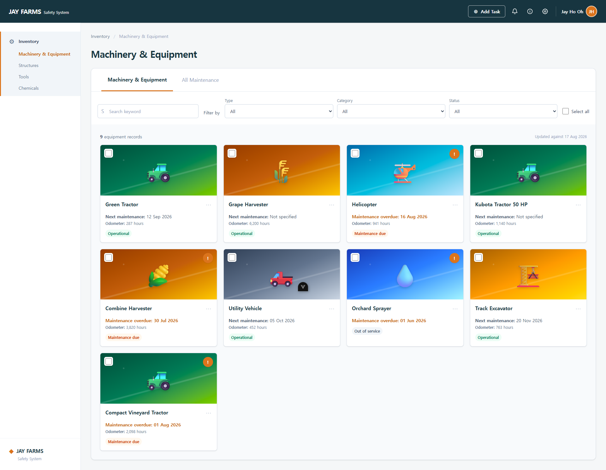

# JAY FARMS Safety System



A small QA automation practice project built to learn Playwright through a simplified agricultural equipment-management workflow.

The project was inspired by a publicly demonstrated farm equipment-management system and is not affiliated with or presented as an official product of that company.

## Features Under Test

- Search
- Filtering
- Maintenance status
- Equipment selection

Only the workflows listed above are implemented and tested. Other UI elements are included as visual mockups only.

## Test Cases

### Filter

- Type filter limits results
- Category filter limits results
- Status filter limits results
- Multiple filters use AND logic
- Search and filters work together

### Maintenance

- Renders overdue, future, and unspecified maintenance states against the fixed `2026-08-17` reference date

### Search

- Searching for `tractor` displays all matching tractors
- Search is case-insensitive
- Search supports partial equipment names
- Search trims leading and trailing whitespace
- A nonexistent keyword produces an empty state

### Selection

- Selecting one item shows the singular count and print action
- Selecting, deselecting, and cancelling keep the selected count accurate
- Print QR Code opens an accessible confirmation dialog
- Select All affects only the three currently visible filtered records

## Tech Stack

- Vue 3
- TypeScript
- Vite
- Tailwind CSS
- Playwright

## Running Locally

```sh
pnpm install
pnpm dev
```

Open `http://localhost:5173`.

## Running Tests

Install Playwright browsers:

```sh
pnpm exec playwright install
```

Run the full E2E test suite:

```sh
pnpm test:e2e
```

Run a specific test file:

```sh
pnpm exec playwright test tests/selection.spec.ts
```

Run in Chromium only:

```sh
pnpm exec playwright test --project=chromium
```

Open Playwright UI mode:

```sh
pnpm exec playwright test --ui
```
